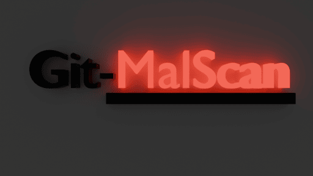
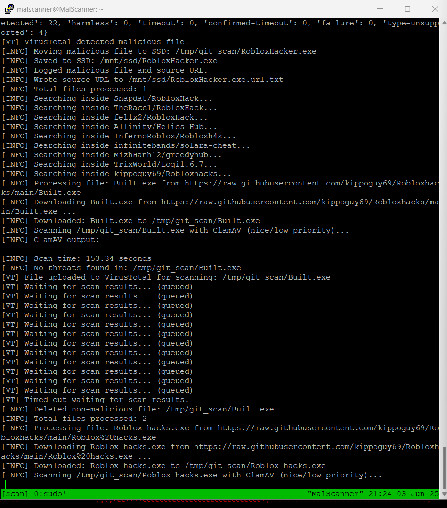

# Git-MalScan

---
A Python script to **automatically search GitHub for `.exe` files**, download them, and scan them for malware using [ClamAV](https://www.clamav.net/) and [VirusTotal](https://www.virustotal.com/). Results are logged and malicious files are saved for further analysis.


NOTICE: V2 added folder creation to make sorting easier.
---

## Features

- Searches GitHub repositories for `.exe` files using the GitHub API.
- Downloads and scans each file with ClamAV.
- Then scans files with VirusTotal (API key required, respects rate limits).
- Maintains blocklists to avoid reprocessing the same files or repositories.
- Logs all actions and results.
- Designed for use on a Raspberry Pi or Linux system with SSD storage.
- Automatically installs missing Python dependencies.
- Automatically logs the source address to a file inside a folder containing the binary, allows for easier reporting.
---

## Requirements

- Python 3.7+
- [ClamAV](https://www.clamav.net/) installed and available in your PATH
- A [GitHub Personal Access Token](https://github.com/settings/tokens) with `repo` access
- A [VirusTotal API key](https://www.virustotal.com/gui/join-us) (optional, but recommended)
- Linux system (uses `/mnt/ssd` and `nice` command; adjust for other OSes as needed)

---

## Setup

1. **Clone this repository or download the script:**

    ```sh
    git clone https://github.com/Net-Zer0/MalScan.git
    cd malscan.py
    ```

2. **Install ClamAV:**

    ```sh
    sudo apt update
    sudo apt install clamav
    ```

3. **Edit the script:**

    - Replace the `GITHUB_TOKEN` and `VT_API_KEY` variables at the top of the script with your own keys.

4. **(Optional) Adjust directories:**

    - By default, the script uses `/mnt/ssd` for storage and `/tmp/git_scan` for temporary files. Change these if needed.

---

## Usage

Run the script with Python 3:

```sh
sudo python3 
